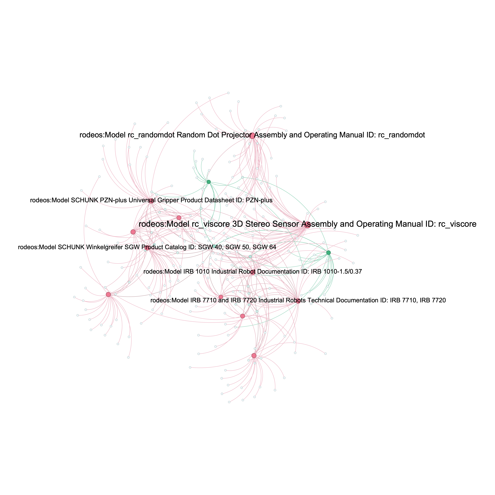

# RODEOS - Automatic Semantic Description Generator and Mapper

**RObotic Data EcOsystem Semantic Model** - Powered by LLMs

RODEOS addresses the critical challenge in industry robotics where every new robot arrives with proprietary file formats, capability vocabularies, and safety descriptors, forcing engineering teams into multi-week manual integration cycles. This toolkit provides an automated pipeline to extract, contextualize, and prepare technical documents for transformation into the RODEOS semantic model.

## 🎯 Project Overview

RODEOS is a vendor-neutral semantic blueprint co-defined by a consortium of 24 industrial partners that extends W3C DCAT-3 with robotics-specific classes for:
- **Raw Data**: Sensor logs, trajectory traces, inspection images, PDFs
- **Models**: Kinematic graphs, CAD files, simulation meshes  
- **Services**: Motion skills, perception pipelines, safety checks

**Checkout the detailed overview [RODEOS](assets/rodeos_architecture/RODEOS.md)**

This repository implements an LLM-assisted authoring workflow that converts technical documentation into structured, contextual chunks ready for semantic model transformation.

## RODEOS KNOWLEDGE GRAPH



## 🚀 Quick Setup

### Prerequisites
- Python 3.11+
- [uv](https://docs.astral.sh/uv/) package manager

### Environment Setup

```bash
# Clone the repository
git clone <repository-url>
cd RODEOS

# Create and activate virtual environment with uv
uv venv
source .venv/bin/activate  # On Windows: .venv\Scripts\activate

# Install dependencies
uv sync

# Set up environment variables
cp .env.example .env
# Edit .env with your API keys (see below)
```

### Required Environment Variables

```bash
# For remote PDF processing (recommended)
MISTRAL_API_KEY=your_mistral_api_key_here

# For remote contextualization (optional)
OPENROUTER_API_KEY=your_openrouter_api_key_here
```

## ⚡ Complete Pipeline with Make

Run the entire RODEOS pipeline (extraction → contextualization → semantic model creation) with simple commands:

```bash
# Process single PDF (remote)
make process FILE=document.pdf

# Process single PDF (local)
make process-local FILE=document.pdf

# Batch process all PDFs (remote)
make process-batch

# Batch process all PDFs (local)
make process-batch-local

# Generate knowledge graph (remote)
make kg

# Generate knowledge graph (local)
make kg-local

# Open knowledge graph visualization
make kg-open

# Custom remote model
make process FILE=document.pdf REMOTE_MODEL=anthropic/claude-3-haiku

# Custom local model
make process-local FILE=document.pdf LOCAL_MODEL=llama3.2:3b

# Check pipeline status
make status

# Clean all generated files
make clean
```

**Pipeline Flow:** PDF → Markdown → Chunked → Semantic Model (JSON) → Knowledge Graph

## 📋 Processing Pipeline

The RODEOS pipeline consists of two main phases:

### Phase 1: Document Data Extraction

Extract structured markdown from PDF technical documents using either remote or local processing.

#### Option A: Remote Processing with Mistral AI (Recommended)

**Why Mistral?** Mistral AI's OCR service provides state-of-the-art accuracy for technical documents, handles complex layouts, tables, and diagrams effectively, and maintains document structure crucial for robotics specifications.

```bash
# Process single PDF
python src/informationExtraction/mistralApiExtraction.py assets/pdf/document.pdf

# Process PDF from URL
python src/informationExtraction/mistralApiExtraction.py --url https://example.com/document.pdf

# Custom output directory
python src/informationExtraction/mistralApiExtraction.py document.pdf --output-dir custom_output
```

**Features:**
- ✅ High accuracy OCR for technical documents
- ✅ Cloud-based processing (no local setup required)
- ✅ Handles complex layouts, tables, and diagrams
- ✅ Fast processing
- ❌ Requires API key and internet connection
- ❌ Images are placeholders (no actual image extraction)

#### Option B: Local Processing with Docling (Privacy-First Alternative)

For organizations requiring on-premises processing or working with sensitive documents.

```bash
# Basic local processing (fast)
python src/informationExtraction/localDoclingExtraction.py document.pdf

# Enhanced processing with VLM (requires Ollama + vision model)
python src/informationExtraction/localDoclingExtraction.py document.pdf --enhanced

# Process specific pages with timeout control
python src/informationExtraction/localDoclingExtraction.py document.pdf --enhanced --pages 1 5 --timeout 600
```

**Setup for Enhanced Mode:**
```bash
# Install and start Ollama
curl -fsSL https://ollama.ai/install.sh | sh
ollama serve

# Install a vision model (choose one)
ollama pull llava:7b          # Faster, good quality
ollama pull moondream:latest  # Lightweight
```

**Features:**
- ✅ Complete privacy (local processing)
- ✅ Image extraction and description
- ✅ No API costs
- ✅ Customizable processing pipelines
- ❌ Requires local setup and computational resources
- ❌ Slower processing for complex documents

### Phase 2: Contextual Enrichment

Transform extracted markdown into semantically enriched chunks with contextual information for downstream RODEOS semantic model transformation.

```bash
# Process single file (local model)
python src/contextualEnrichment/context.py assets/markdown/document_MISTRAL.md

# Process all markdown files (batch mode)
python src/contextualEnrichment/context.py --batch

# Use remote model via OpenRouter (recommended for production)
python src/contextualEnrichment/context.py --batch --remote openai/gpt-4o-mini

# Use different remote models
python src/contextualEnrichment/context.py --batch --remote anthropic/claude-3-haiku
```

**Local Processing Setup:**
```bash
# Install Ollama (if not already installed)
curl -fsSL https://ollama.ai/install.sh | sh
ollama serve

# Install a suitable model
ollama pull deepseek-r1:8b    # Default model
ollama pull llama3.2:3b       # Alternative option
```

**What Context Processing Does:**
1. **Semantic Chunking**: Uses LLM to intelligently split documents by topic/theme
2. **Context Enrichment**: Adds relevant background information to each chunk
3. **Structure Preparation**: Formats content for RODEOS semantic model transformation
4. **Prompt Transparency**: Saves all prompts used for full auditability

### Phase 3: Semantic Model Extraction

Transform contextualized chunks into structured RODEOS semantic models with automated asset type detection and metadata extraction.

```bash
# Process single chunked file
python src/extractInformation/extraction.py assets/markdown/document_CHUNKED.md

# Batch process all chunked files
python src/extractInformation/extraction.py --batch

# Use different model
python src/extractInformation/extraction.py --batch --model anthropic/claude-3-haiku

# Custom output directory
python src/extractInformation/extraction.py document_CHUNKED.md --output-dir custom_output
```

**What Semantic Extraction Does:**
1. **Asset Type Detection**: Automatically classifies content as Dataset, Model, or Service
2. **Metadata Extraction**: Populates RODEOS JSON structure with document-derived information
3. **Submodel Integration**: Selects and integrates appropriate AAS submodels
4. **JSON Validation**: Ensures well-formed semantic model output with retry logic
5. **Structured Output**: Creates camelCase JSON files ready for RODEOS ecosystem

**Features:**
- ✅ Multi-step LLM analysis via OpenRouter
- ✅ Intelligent asset type classification (Dataset/Model/Service)
- ✅ JSON validation with automatic retry on parsing errors
- ✅ AAS submodel selection and integration
- ✅ RODEOS structure compliance
- ✅ Batch processing support

### Phase 4: Knowledge Graph Generation

Transform multiple semantic models into interactive knowledge graphs that visualize relationships between assets, properties, and metadata across your robotic ecosystem.

```bash
# Generate knowledge graph from all semantic models
python src/knowledgeGraphGeneration/kg.py

# Use local model for value normalization
python src/knowledgeGraphGeneration/kg.py --local

# Use different model for better normalization
python src/knowledgeGraphGeneration/kg.py --model anthropic/claude-3-haiku

# Custom input and output directories
python src/knowledgeGraphGeneration/kg.py --models-dir custom_models --output-dir custom_kg
```

**What Knowledge Graph Generation Does:**
1. **Data Extraction**: Processes all semantic models to extract graph-relevant properties and metadata
2. **Value Normalization**: Uses LLM to normalize similar values (e.g., "Roboception GmbH" and "roboception" → "Roboception GmbH")
3. **Graph Construction**: Builds NetworkX graph with nodes for assets and values, edges for relationships
4. **Interactive Visualization**: Creates dynamic HTML visualization using pyvis with physics simulation
5. **Data Export**: Saves graph structure and statistics as JSON for further analysis

**Features:**
- ✅ Automatic value normalization to reduce duplicates
- ✅ Interactive HTML visualization with physics simulation
- ✅ Color-coded nodes by property type (DCAT, RODEOS, metadata)
- ✅ Comprehensive tooltips and relationship labels
- ✅ JSON export for programmatic access
- ✅ GEXF export for advanced analysis in Gephi
- ✅ Statistics and metrics generation

**Example Knowledge Graph:**
<!-- Placeholder for knowledge graph visualization image -->

*Interactive knowledge graph showing relationships between robotic assets, their properties, and metadata across the RODEOS ecosystem*

## 📁 Output Structure

```
assets/
├── pdf/                    # Original PDF files
├── markdown/               # Extracted markdown files
│   ├── document_MISTRAL.md    # From Mistral AI processing
│   ├── document_DOCLING_basic.md  # From basic local processing
│   ├── document_DOCLING_enhanced.md  # From enhanced local processing
│   └── document_CHUNKED.md    # Contextualized chunks ready for semantic transformation
├── models/                 # Generated semantic models
│   └── documentSemanticModel.json  # RODEOS-compliant JSON structure
├── kg/                     # Knowledge graph outputs
│   ├── knowledge_graph.html       # Interactive visualization
│   ├── knowledge_graph_data.json  # Graph structure and statistics
│   ├── knowledge_graph.gexf       # Gephi-compatible graph file
│   └── example_knowledge_graph.png # Example visualization image
└── submodels/              # AAS submodel templates
    ├── aas_ai_dataset.json
    ├── aas_ai_deployment.json
    ├── aas_generic_frame_technical_data.json
    └── submodel_descriptions.md
    
src/contextualEnrichment/prompts/  # All LLM prompts for transparency
├── document_PROMPT_chunking.md
└── document_PROMPT_contextualization.md

src/knowledgeGraphGeneration/      # Individual model graph data
├── documentSemanticModel_graph.json
└── ...                           # One graph.json per semantic model
```

## 🎛️ Configuration Examples

### High-Quality Production Pipeline
```bash
# 1. Extract with Mistral AI (best accuracy)
python src/informationExtraction/mistralApiExtraction.py technical_spec.pdf

# 2. Contextualize with GPT-4 (best reasoning)
python src/contextualEnrichment/context.py --batch --remote openai/gpt-4o-mini
```

### Privacy-First On-Premises Pipeline
```bash
# 1. Extract locally with enhanced VLM
python src/informationExtraction/localDoclingExtraction.py technical_spec.pdf --enhanced

# 2. Contextualize with local model
python src/contextualEnrichment/context.py --batch --model deepseek-r1:8b
```

### Development/Testing Pipeline
```bash
# 1. Quick extraction with Mistral
python src/informationExtraction/mistralApiExtraction.py test_doc.pdf

# 2. Fast contextualization with local model
python src/contextualEnrichment/context.py assets/markdown/test_doc_MISTRAL.md
```

## 🔧 Advanced Features

### Prompt Transparency
All LLM interactions are saved as markdown files in `src/contextualEnrichment/prompts/` for:
- Audit trails and compliance
- Prompt engineering and optimization
- Reproducibility and debugging

### Thinking Tag Filtering
The system automatically removes `<think>...</think>` blocks from model responses to ensure clean output.

### Flexible Model Support
- **Local**: Any Ollama-compatible model
- **Remote**: 200+ models via OpenRouter (OpenAI, Anthropic, Google, etc.)

## 🤝 Contributing to RODEOS

The contextually enriched documents produced by this pipeline are designed to feed into the RODEOS semantic model transformation process, enabling:

1. **Automated Asset Classification**: Categorizing content into raw data, models, or services
2. **Capability Extraction**: Identifying robot capabilities, skills, and tasks
3. **Safety Annotation**: Extracting risk assessments and safety policies
4. **Metadata Generation**: Creating DCAT-3 compliant metadata

This bridges the gap between unstructured technical documentation and structured semantic knowledge, enabling the vision of automated robot integration across diverse industrial environments.


## Funding

This open-source project was developed within the *[ROX](https://www.project-rox.ai/en/)* project. 
This project has received public funding from the **European Union** NextGenerationEU within the Important Project of Common European Interest – Cloud Infrastructures and Services (IPCEI-CIS).

<p align="center">
  
</p>

